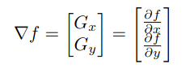
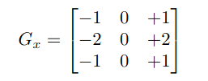
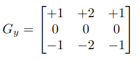
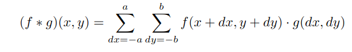
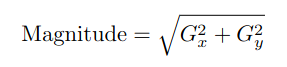
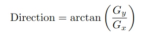
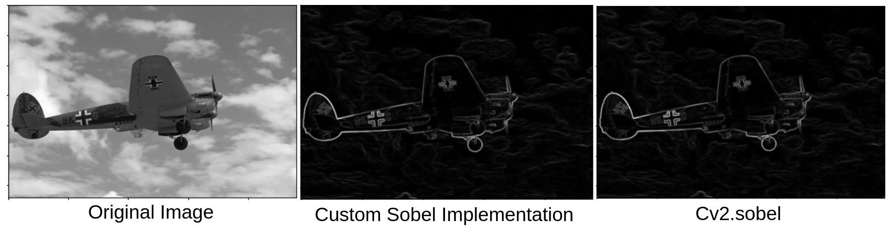
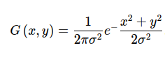

# Edge Detection in Computer Vision

## Introduction 
Edge detection is the process of identifying sharp changes in image intensity to capture object boundaries. Edge detecion is the basis for object detection and image processing. 

## Methods for Edge Detection
- **Gradient-Based Methods**: Detecting edges by examining the maximum and minimum of the first derivative of the image. 
- **Second Derivative Methods**: Using the seconf derivative. eg:- Laplacian method

## Edge Detection Algorithms
- **Sobel Operator**
- **Canny Edge Detector**
- **Prewitt Operator**
- **Laplacian of Gaussian (LoG)**
- **Roberts Cross Operator**

## Applications of Edge Detection
1. Image Segmentation
2. Object Detection
3. Feature Extraction

## Algorithms Implementation
### 1. Sobel Operator
- Sobel Operator is a widely used edge detection algorithm in image processing. It works by calculating the gradient of the image intensity at each pixel.
- An image can be considered as a two-dimensional function \(f(x,y) \), where the value of \( (x,y) \) represents the pixel intensity.
- **Gradient**: The gradient of \( f \) at any point is a 2D vector with components representing the derivatives in the horizontal and vertical directions     
   
   
- **Sobel Kernels**: Sobel operator uses two 3x3 convolution kernels to approximate the derivatives
   Horizontal changes (Gx) and vertical changes (Gy)     
    
    
    

- **convolution**: The sobel kernels Gx  and Gy are convolved seperately with the image to produce two derivative approximations, one for the horizontal direction and one for the vertical direction.
     

- **Gradient Magnitude**: The magnitude of the gradient at each pixel gives the edge stength. 
    Magnitude  
     

- **Gradient Direction**: The direction of the edge can be calculated as the inverse tangent of the ratio of the vertical to the horizontal gradient
     Direction    
      

- **Sobel Applied**:
      
    
### 2. Canny Edge detector 
- Canny is a multi-stage detection algorithm and the steps are noise reduction, finding the intensity gradient of the image, non-max suppression and hysteresis thresholding.
- **Noise Reduction**: Noise in images can significantly affect edge detection accuracy. A Gaussian filter smooths the image to reduce noise, preserving edge properties.
  The Gaussian function for a kernel is given by:  
     
  where x and y are distances from the center in the horizontal and vertical directions, respectively, and \sigma is the standard deviation of the Gaussian distribution. This filter is convolved with the image to produce a smoothed version.We are using a 5x5 kernel.
- **Gradient Calculation**:The sobel operator is used to find the intensity gradient of the image.The magnitude and direction fo the gradient at each pixel are calculated.  
- **Non-Maximum Suppression**: This step thins out the edges. For each pixel, it checks if the pixel is the local maximum in its gradient direction. If not, the pixel is set to 0 (black), effectively thinning the edges.  
- **Double Thresholding**: To further remove noise and false positives, pixels are classified as strong, weak, or non-relevant based on their intensity. Strong edges are immediately included as part of the final edge, while weak edges are included only if they are connected to strong edges.
Weak edges that are not connected to strong edges are removed. This step ensures that the final image has only strong edges, providing clear and distinct boundaries.- ** Edge tracking by Hysteresis**: Weak edges that are not connected to strong edges are removed. This step ensures that the final image has only strong edges, providing clear and distinct boundaries.
 
- **Results on Canny detector**:  
  
  
